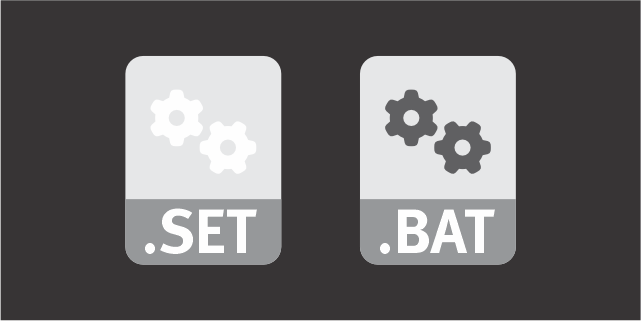

# Batch Malware Set-Deobfuscation Tool

This is a Python script for deobfuscating malware batch files by replacing variables with their corresponding values.

This is not a static tool, this tool requires you to run the obfuscated code and then export the "set" list from cmd.exe,
add the following code to the end of the obfuscated batch file sample:

```
set > set_list.txt
```

## Prerequisites

Before using this deobfuscation method, ensure you have the following prerequisites:

- Python 3.x
- A virtual machine (VM) or sandbox environment for safely executing obfuscated batch files
- A batch file to deobfuscate
- A text file containing a list of variable assignments (referred to as the "set" file)

## Usage

1. **Clone this repository to your local machine.**

   ```bash
   git clone https://github.com/Bamorph/set_deob.git
   ```

2. **Prepare the "set" file:**
   - In the controlled environment (VM or sandbox), execute the obfuscated batch file.
   - Use the "set" command in the command prompt to list the current environment variables.
   - Save the list of variables and their values to a text file. This file will be used as the "set" file in the deobfuscation process.

3. **Run the deobfuscation script:**
   ```bash
   python set_deob.py <set_file> <obfuscated_file>
   ```

4. **Deobfuscated Output:**

   The deobfuscated code will be saved in a file with the same name as the obfuscated file but with "_deob" added before the file extension.

   For example, if the obfuscated file is named "batchfuscation.bat," the deobfuscated file will be named "batchfuscation_deob.bat."

## Warning

**Caution**: This tool is designed for security analysts and researchers working with malware samples in controlled environments. Running or executing malware on your system is highly dangerous and should only be done in a secure and isolated environment, such as a sandbox or virtual machine. It is crucial to take all necessary precautions to prevent any unintended harm to your system or network.

**Never run malware on your production or personal devices. Always follow legal and ethical guidelines when handling and analyzing malware.**
